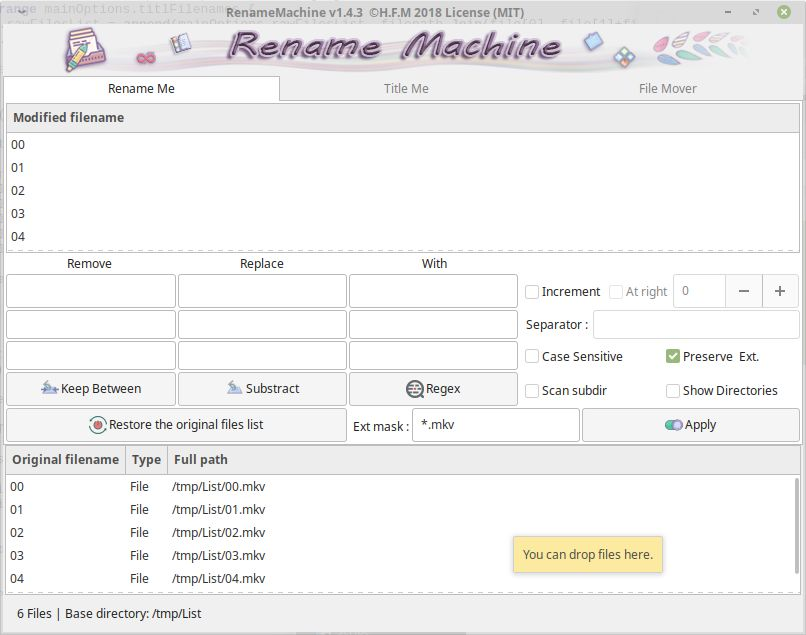
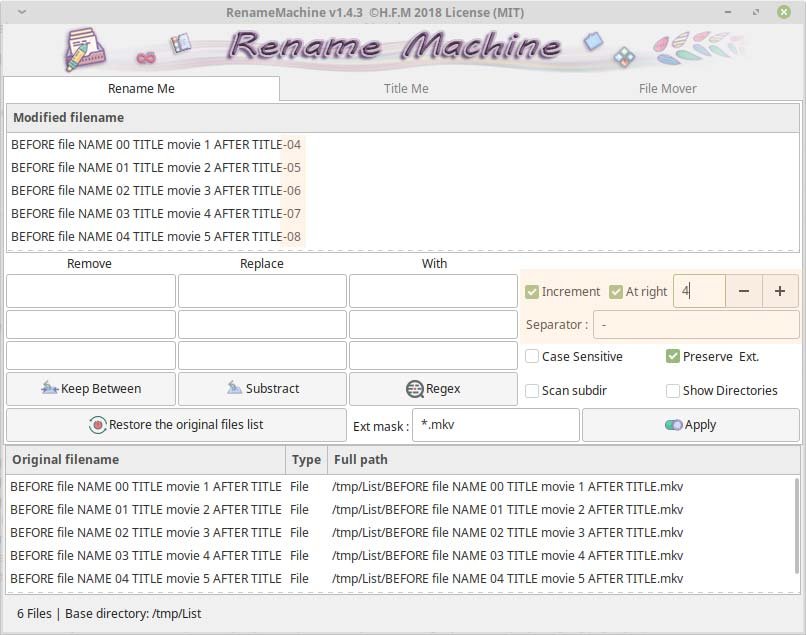
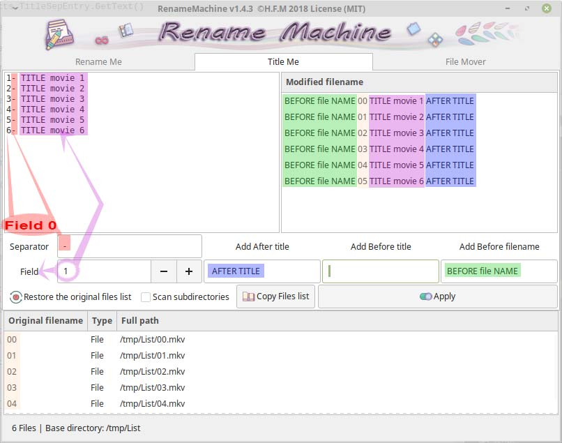

# Rename Machine
*This program is designed to rename/cleaning filenames, adding titles (from a list) and provide specific tag insertion and moving files contained in multi directories to a single folder ... lot of option availables (regex, Posix character classes, case sensitive, keep between, extract).*

Take a look [here, H.F.M repositories](https://github.com/hfmrow/) for other useful linux softwares.

- If you just want to use it, simply download the compiled version under the "release" tab. You can see at [the Right way to install H.F.M's softwares](https://github.com/hfmrow/instHFMsofts) page to integrate this software in your debian environment.
	
- If you want to play inside code, see below "How to compile" section.

## How it's made
- Programmed with go language: [golang](https://golang.org/doc/) 
- GUI provided by [Gotk3 (gtk3 v3.22)](https://github.com/gotk3/gotk3), GUI library for Go (minimum required v3.16).
- I use home-made software: "Gotk3ObjHandler" to embed images/icons, UI-information and manage/generate gtk3 objects code from [glade ui designer](https://glade.gnome.org/). and "Gotk3ObjTranslate" to generate the language files and the assignment of a tooltip on the gtk3 objects (both are not published at the moment, in fact, they need documentations and, for the moment, I have not had the time to do them).

## Functionalities
- Single or multi-files interface.
- Rename single or multiple files at once.
- Remove parts of filename (3 patterns at once).
- Replace parts of filename (3 patterns at once).
- Keep between patterns possibility (Case sensitive, posix [Character classes](https://www.regular-expressions.info/posixbrackets.html)).
- Pattern substraction possibility (Case sensitive, posix [Character classes](https://www.regular-expressions.info/posixbrackets.html)).
- Ability to use regex for removing patterns.
- Drag and drop capacity available.
- Add at begin or at end an incrementation.
- Mask for filtering by extensions.
- Function to preserve extensions.
- Add titles list to filenames (from an existing list, usefull for series, music albums)
- Move files contained in multiple folders and subfolders to a single directory in one click.
- Each function have his tooltip for explanations.

## Some pictures and explanations  

**Single entry window.**  
  

**This is the main screen.**  
  

**Remove & Replace multiples patterns.**  
  

**Add incremental numbers to file names.**  
  

**The keep between window**  
  

**Keep between.**
*Applied using posix [character classes](https://www.regular-expressions.info/posixbrackets.html)  option. By this way, numeric values "00,01,02,03,..." will always matching for replacement or removing.*  
  

**Using regular expression to replace pattern.**
*In this case, (\i) mean to be case insensitive context, between in parentheses, there is the pattern to find (upper and lower cases), the dot "." mean any single character, and "[[:digit:]]" for any single number "0-9" in posix [character classes](https://www.regular-expressions.info/posixbrackets.html) notation.*  
  

 **Substract pattern using posix**  [Character classes](https://www.regular-expressions.info/posixbrackets.html).
*Usefull for series or audio files. The (**1** entry) will be internally transformed into ([[:upper:]][[:upper:]][[:upper:]][[:upper:]][[:space:]][[:digit:]][[:digit:]]) full (**2** character classe compliant), using (**3** strinct mode) *  
  

 **Adding Titles to filenames.**
*On upper left box, you can past titles list (from wikipedia for exemple), At bottom center you have your files, at top right box you got the result. As you can see, before each title you have “**1-**” a number and a dash, you only want to keep the line after the dash. So, you define “Separator” as **-**, the “Field” at **1** and a simple space “Before title”. I have added more entry to see somes possibilities.  *  
  

## How to compile
- Be sure you have golang installed in right way. [Go installation](https://golang.org/doc/install).
- Open terminal window and at command prompt, type: `go get github.com/hfmrow/renMachine`
- See [Gotk3 Installation instructions](https://github.com/gotk3/gotk3/wiki#installation) for gui installation instruction.
- To change gtk3 interface you need to use a home made software, (not published actually). So don't change gtk3 interface (glade file) ...
- To change language file you need to use another home made software, (not published actually). So don't change language file ...
- To Produce a stand-alone executable, you must change inside "main.go" file:

		func main() {
			devMode = true
		...
into

		func main() {
			devMode = false
		...

This operation indicate that externals datas (Image/Icons) must be embedded into the executable file.

### Misc/Os informations
- I'm working on:

| DISTRIB  | LinuxMint |
| -------- | --------- |
| VERSION  | 19.1  |
| CODENAME  | tessa  |
| RELEASE  | #21~18.04.1-Ubuntu SMP Thu Jun 27 04:04:37 UTC 2019  |
| UBUNTU_CODENAME  | bionic  |
| KERNEL  | 5.0.0-20-generic  |
| HDWPLATFORM  | x86_64  |
| GTK  | libgtk-3-0:amd64 3.22.30-1ubuntu3  |
| GLIB  | Ubuntu GLIBC 2.27-3ubuntu1  |

- The compilation have not been tested under Windows or Mac OS, but all file access functions, line-end manipulations or charset implementation are made with OS portability in mind.

## You got an issue ?
- Give informations (as above), about used platform and OS version.
- Provide a method to reproduce the problem.

## Website
- [H.F.M Linux softwares](https://hfmrow.yo.fr/) Free linux software on Github. Sharing knowledge.
